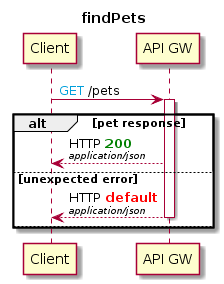
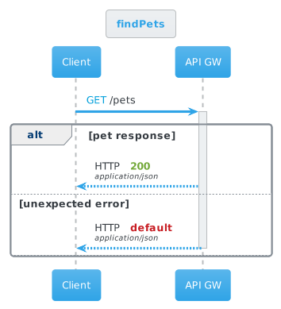

# omskep
Assists in the generatation of diagrams (png, svg, canvas, etc) based on standard file formats, such as Swagger, OpenAPI, AWS Cloud Formation Templates, Ansible Templates, by providing the text markdown for renderers to take advantage of.

# Usage

## Command line (CLI)
  
  #### CLI Usage
  ~~~
  omskep <diagram type> [options] filename
  ~~~

  #### Basic invocation
  ~~~
  omskep-cli sequence -path /pets -verb get petstore.json
  ~~~
  
  #### Pipe contents into the CLI
  ~~~
   cat petstore.json | omskep-cli sequence -path /pets -verb get -server %title% 
  ~~~
  
  #### Output
  ~~~
  @startuml
  !GET = "<color #009fdb>GET</color>"
  !POST = "<color #007a3e>POST</color>"
  !PUT = "<color #ea7400>PUT</color>"
  !DELETE = "<color #cf2a2a>DELETE</color>"
  !PATCH = "<color #b5bd00>PATCH</color>"
  !HEAD = "<color #9012fe>HEAD</color>"
  !OPTIONS = "<color #0d5aa7>OPTIONS</color>"
  !if %not(%function_exists("$success"))
  !function $success($msg)
  <b>$msg
  !endfunction
  !endif
  !if %not(%function_exists("$failure"))
  !function $failure($msg)
  <b>$msg
  !endfunction
  !endif
  !if %not(%function_exists("$warning"))
  !function $warning($msg)
  <b>$msg
  !endfunction
  !endif

  title findPets

  participant "Client" as C
  participant "API Gateway" as G
  C->G: GET /pets
  activate G
  alt pet response
  G-->C: HTTP $success(200)
  else unexpected error
  G-->C: HTTP $failure(default)
  else 
  deactivate G
  end
  @enduml

  ~~~
  
  #### Getting image (plantuml)
  ~~~
  omskep-cli sequence -path /pets -verb get petstore.json | java -jar plantuml.jar -pipe > getPets.png
  ~~~
  
  
  
  #### Getting image with theme (plantuml)
  ~~~
  omskep-cli sequence -path /pets -verb get -theme cerulean petstore.json | java -jar plantuml.jar -pipe > getPets.png
  ~~~
  
  
  

## Node.js

## JavaScript (Browser)

