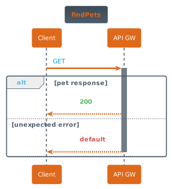

Assists in the generatation of diagrams (png, svg, canvas, etc) based on standard file formats, such as Swagger, OpenAPI, AWS Cloud Formation Templates, Ansible Templates, by providing the text markdown for renderers to take advantage of.

# How to Use It.
Can be used either on the command line (CLI), Node.js or with JavaScript.

  <button id="text-btn" class="tablinks button active" onclick="openTab('cli')">Command line (CLI)</button>
  <button id="diagram-btn" class="tablinks button" onclick="openTab('node')">Node.js</button>
  <button id="diagram-btn" class="tablinks button" onclick="openTab('js')">JavaScript (Browser)</button>

## Command line (CLI)

### Syntax
~~~
omskep <diagram type> [options (key/value pairs)] <input file> [<input file> <input file> ...]
~~~

### Basic invocation
Generate plantuml sequence markdown for an operation (GET /pets) from a Swagger file
~~~
omskep sequence -path /pets -verb get petstore.json
~~~

### Pipe contents into the CLI
If the input file (Swagger file here) is generated from some other process, it can be piped into ``omskep``
~~~
cat petstore.json | omskep sequence -path /pets -verb get 
~~~

### Output
~~~
@startuml
!GET = "<color #009fdb>GET</color>"
!POST = "<color #007a3e>POST</color>"
!PUT = "<color #ea7400>PUT</color>"
!DELETE = "<color #cf2a2a>DELETE</color>"
!PATCH = "<color #b5bd00>PATCH</color>"
!HEAD = "<color #9012fe>HEAD</color>"
!OPTIONS = "<color #0d5aa7>OPTIONS</color>"
!if %not(%function_exists("$success"))
!function $success($msg)
<b>$msg
!endfunction
!endif
!if %not(%function_exists("$failure"))
!function $failure($msg)
<b>$msg
!endfunction
!endif
!if %not(%function_exists("$warning"))
!function $warning($msg)
<b>$msg
!endfunction
!endif

title findPets

participant "Client" as C
participant "API Gateway" as G
C->G: GET /pets
activate G
alt pet response
G-->C: HTTP $success(200)
else unexpected error
G-->C: HTTP $failure(default)
else 
deactivate G
end
@enduml

~~~

### Getting image (local plantuml)
Generate an image by piping the output to a local ``plantuml.jar`` program.
~~~
omskep sequence -path /pets -verb get petstore.json | java -jar plantuml.jar -pipe > getPets.png
~~~
Specifying the ``cerulean`` theme from [puml-themes](https://bschwarz.github.io/puml-themes/) with the ``-theme`` option
~~~
omskep sequence -path /pets -verb get -theme cerulean petstore.json | java -jar plantuml.jar -pipe > getPets-cerulean.png
~~~
Specifying the ``superhero`` theme from [puml-themes](https://bschwarz.github.io/puml-themes/) with the ``-theme`` option
~~~
omskep sequence -path /pets -verb get -theme superhero petstore.json | java -jar plantuml.jar -pipe > getPets-superhero.png
~~~

  

### Getting image (remote plantuml server)
If you don't have a local install of the ``plantuml.jar`` program, you can use the ``-pumlurl`` option to generate the url to send the markdown generated from ``omskep-cli`` to fetch the image from the plantuml server, using either ``wget`` or ``curl``

**Note:** You will need to have the [plantuml-encoder](https://www.npmjs.com/package/plantuml-encoder) node package installed to use this option.

Using ``wget`` with command substitution
~~~
wget $(omskep sequence -path /pets -verb get -pumlurl png petstore.json) -O getPets.png
~~~
Using ``curl`` with command substitution.
~~~
curl --url $(omskep sequence -path /pets -verb get -theme cerulean -pumlurl png petstore.json) > getPets.png
~~~
Using ``curl`` with ``xargs``
~~~
omskep sequence -path /pets -verb get -theme superhero -pumlurl svg  petstore.json | xargs curl > getPets.svg
~~~

## Node.js

## JavaScript (Browser)

